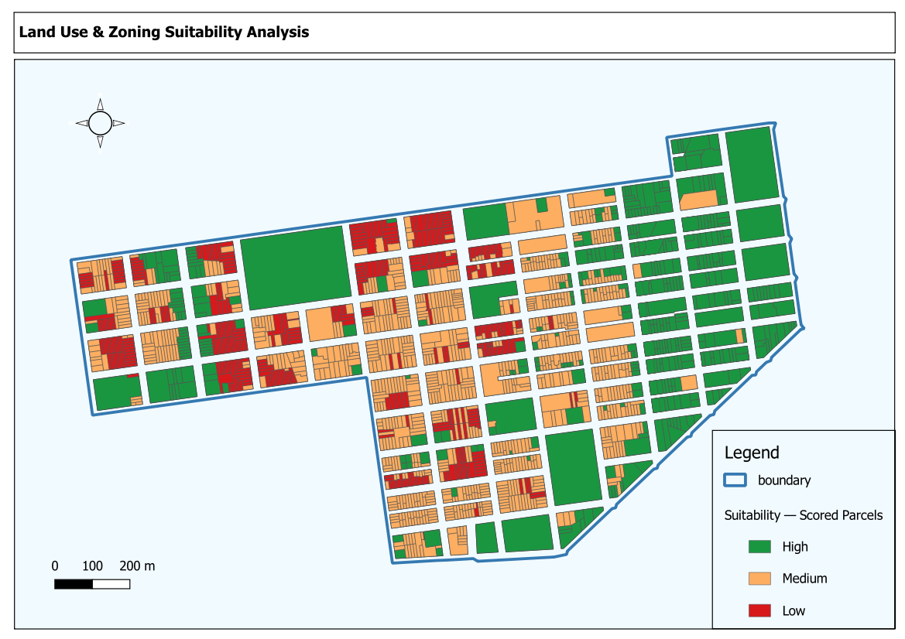
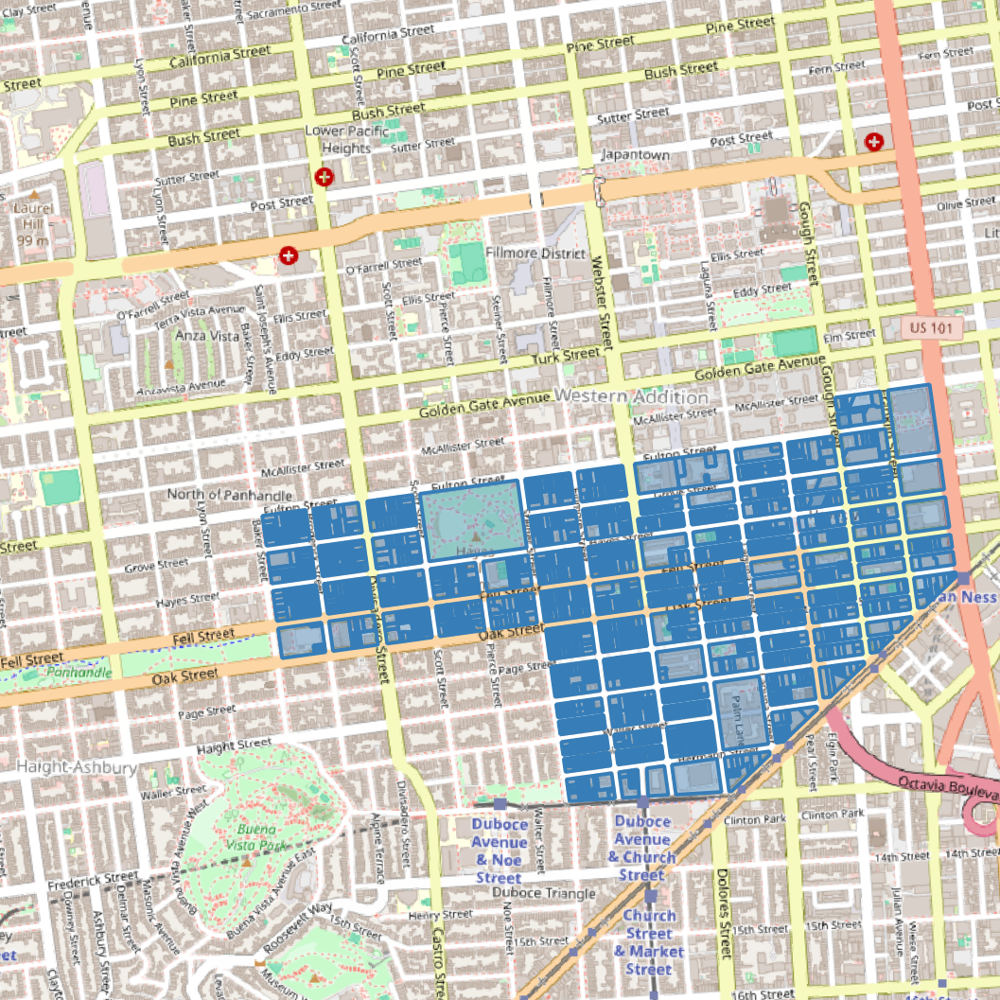

# Land Use & Zoning Suitability Analysis — Extended
**Author:** Martins
**Date:** May 11, 2026
**Version:** 2.0 — Road Accessibility + Development Filter added
**Software:** QGIS (EPSG:2227 — NAD83 / California Zone 3, US Feet)
**Project File:** `Land_Use_Zoning_Suitability_Analysis.qgz`

---

## 1. Project Overview

An extended multi-criteria suitability assessment across 1,904 cadastral parcels
within a defined study boundary. Version 2 adds two improvements over v1:

1. **Road Accessibility Criterion** — a road network proxy is derived from the
   parcel fabric itself and used to score each parcel on street accessibility.
2. **Development Filter** — purely residential parcels (RH-* zoning) are
   identified as already built-out single-family lots and tagged in a separate
   tier so they are never ranked as High suitability candidates.

---

## 2. Input Data

| Layer | Source | Features | Geometry |
|-------|--------|----------|----------|
| `parcels` | Original project layer | 1,904 | Polygon |
| `boundary` | Original project layer | 1 | Polygon (MultiPolygon) |

**CRS:** EPSG:2227 — NAD83 / California Zone 3, US Feet

---

## 3. Road Network Proxy — Methodology

No external road dataset was available. The road network is derived from the
parcel fabric using two processing steps:

1. `native:dissolve` — all 1,904 parcel polygons dissolved into a single
   MultiPolygon. The void spaces between blocks (where streets run) become
   interior holes in the dissolved geometry.
2. `native:boundary` — the boundary of the dissolved polygon is extracted as a
   MultiLineString. This line layer represents every street-facing parcel edge
   in the study area (total length: ~134,971 ft).

For each parcel, `ROAD_DIST_FT` is the distance from the parcel centroid to
the nearest point on this proxy line. `ROAD_SC` is the inverse min-max
normalisation of that distance — parcels closer to a road score higher.

---

## 4. Scoring Methodology

### 4.1 Criteria & Weights (5-criteria model)

| Criterion | Field | Weight | Direction |
|-----------|-------|--------|-----------|
| Zoning Suitability | `zoning_sim` lookup | 25 % | Higher commercial = better |
| Parcel Area | `area_sqft` normalised | 25 % | Larger = better |
| Shape Compactness | Isoperimetric quotient | 15 % | More compact = better |
| Boundary Distance | Centroid → boundary | 15 % | Further interior = better |
| Road Accessibility | Centroid → road proxy | 20 % | Closer to road = better |

### 4.2 Zoning Score Lookup (0–3)

| Code(s) | Score |
|---------|-------|
| C-3-* | 3.0 |
| C-2-*, NCT-3, NCT-2 | 2.5 |
| C-1-*, NCT, MUG, MUN | 2.0 |
| NCD, RC-*, PDR-* | 1.5 |
| RM-* | 1.0 |
| RH-*, P | 0.5 |
| null / unmatched | 1.0 |

### 4.3 Composite Score Formula

```
SUIT_SCORE = ((ZONE_SC×0.25) + (AREA_SC×0.25) + (COMP_SC×0.15)
              + (DIST_SC×0.15) + (ROAD_SC×0.20)) × (10/3)
```

### 4.4 Classification Thresholds (Percentile-Based)

| Tier | Threshold | Count |
|------|-----------|-------|
| 🟢 High | ≥ 75th pct (≥ 4.56) | 482 |
| 🟡 Medium | ≥ 25th pct (≥ 3.86) | 846 |
| 🔴 Low | < 25th pct | 165 |
| 🟩 High — Developed | RH-* zone, score ≥ 4.56 | 0 |
| ⬜ Medium — Developed | RH-* zone, score ≥ 3.86 | 115 |
| ░░ Low — Developed | RH-* zone, score < 3.86 | 296 |

---

## 5. Development Filter

Parcels with `zoning_sim` starting with `RH` (Residential House) are flagged
`developed = Yes`. These are single-family residential lots in dense San
Francisco — effectively fully built out and not viable redevelopment candidates.
Their tier label is suffixed with `— Developed` and they are rendered in greyed
tones to visually separate them from genuinely available parcels.

**Total flagged: 411 parcels (21.6 % of dataset)**

---

## 6. Output Fields

| Field | Type | Description |
|-------|------|-------------|
| `blklot` | String | Block-lot identifier |
| `street` | String | Street name |
| `zoning_sim` | String | Simplified zoning code |
| `districtna` | String | Planning district name |
| `area_sqft` | Double | Parcel area (sq ft) |
| `zone_sc` | Double | Zoning sub-score (0–3) |
| `area_sc` | Double | Area sub-score (0–3) |
| `comp_sc` | Double | Compactness sub-score (0–3) |
| `dist_sc` | Double | Boundary-distance sub-score (0–3) |
| `road_dist_ft` | Double | Distance to nearest road proxy (ft) |
| `road_sc` | Double | Road accessibility sub-score (0–3) |
| `suit_score` | Double | Composite suitability score (0–10) |
| `developed` | String | Yes = RH-* zone (built-out) |
| `suit_tier` | String | Final tier label |

---

## 7. Output Files

```
Land Use  - Zoning Suitability Analysis/
├── Land_Use_Zoning_Suitability_Analysis.qgz   ← QGIS project (open this)
├── suitability_analysis_v2.gpkg
│   ├── suitability_scored                     ← Scored & classified parcels
│   ├── road_network_proxy                     ← Derived road network (lines)
│   └── boundary                               ← Study area boundary
└── README.md
```

---

## 8. Map Symbology

| Tier | Colour | Meaning |
|------|--------|---------|
| High | `#1a9641` dark green | Best undeveloped candidates |
| Medium | `#fdae61` amber | Moderate suitability |
| Low | `#d7191c` red | Poor suitability |
| High — Developed | `#74c476` light green | High score but built-out |
| Medium — Developed | `#d9d9d9` light grey | Medium score, built-out |
| Low — Developed | `#bdbdbd` mid grey | Low score, built-out |

Road network proxy is rendered as a dashed orange line.
Study boundary is rendered as a hollow polygon with a dark outline.

---

## 9. Remaining Recommended Extensions

- **Replace road proxy with actual road dataset** (e.g. SF Open Data street
  centrelines) for more precise accessibility scoring.
- **Replace development filter with actual building footprint data** to capture
  partial vacancy, surface parking lots, and underutilised commercial sites.
- **Add transit proximity** — distance to BART/Muni stops as a sixth criterion.

---

*Generated with QGIS MCP Plugin + Claude (Anthropic) — May 11, 2026*

---

## Map Preview





